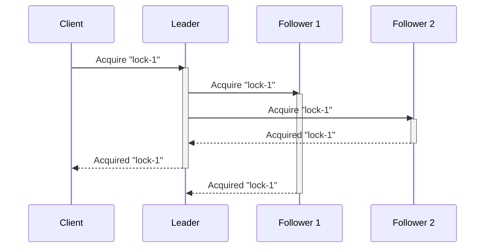
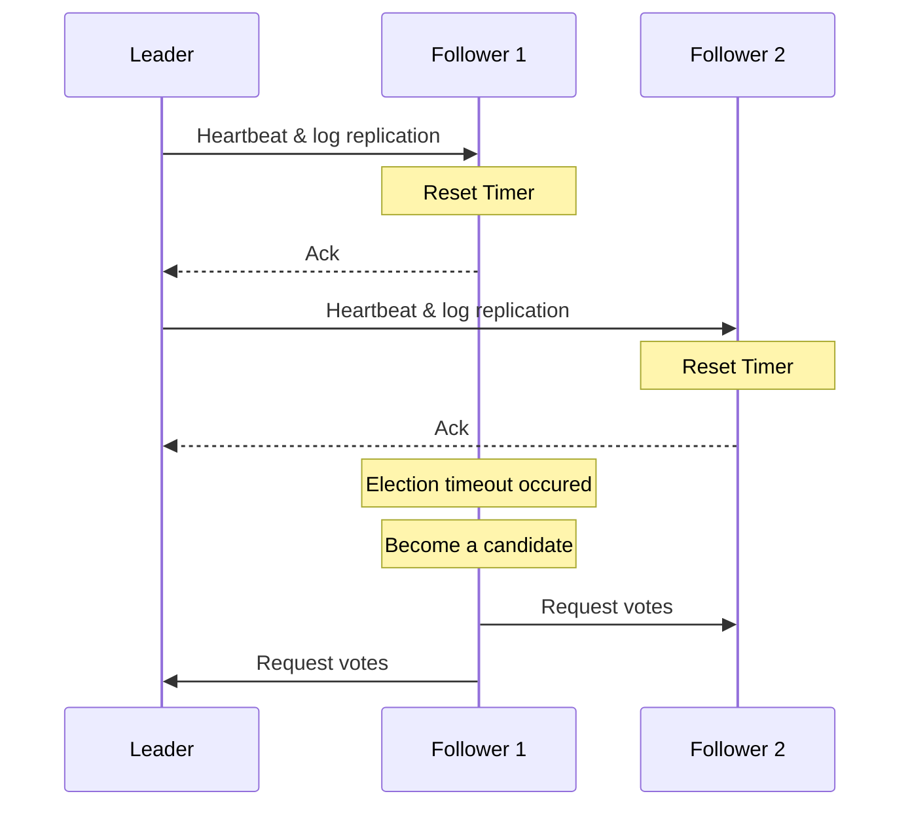

# dlock
`dlock` is yet another distibuted lock based on the Raft consensus algorithm.

The Raft consensus algorithm is a protocol for managing a replicated log across a distributed system to ensure consistency and reliability. Raft is designed to be understandable and practical, offering a robust solution to the consensus problem, which is fundamental for building fault-tolerant distributed systems. 

This means that the majority of nodes needs to agre on a value before acknowledging it and returning to a client, which is demostrated in the following diagram:




## Running dlock

```bash
git clone git@github.com:kgantsov/dlock.git
cd dlock/cmd/server
go build -o dlock
```

Run the first node

```bash
./dlock -id node0 ./data/node0
```

Run other nodes

```bash
./dlock -id node1 -haddr 11001 -raddr localhost:12001 -join :11000 ./data/node1
./dlock -id node2 -haddr 11002 -raddr localhost:12002 -join :11000 ./data/node2
```

You can find swagger docs by opening http://localhost:11000/docs

## Acquiring and releasing locks

To acquire a lock run

```bash
curl --request POST \
  --url http://localhost:11000/API/v1/locks/my-lock-name \
  --header 'Accept: application/json' \
  --header 'Content-Type: application/json'
```

To release a lock run

```bash
curl --request DELETE \
  --url http://localhost:11000/API/v1/locks/my-lock-name \
  --header 'Accept: application/json'
```

## Consistency
Achieving consistency in a distributed lock involves ensuring that only one process or node can acquire the lock at any given time, preventing race conditions and ensuring that operations on shared resources are conducted in a safe and coordinated manner. This means that all acquire and release requests must go through the cluster leader. The leader communicates with other nodes and acknowledges the request once a majority has agreed.

## Tolerating failures
To run a fully fault-tolerant system using the Raft consensus algorithm, you need to configure an odd number of nodes, with a minimum of three nodes. This odd-numbered configuration ensures that the system can tolerate a certain number of node failures while still maintaining the ability to reach a consensus and operate correctly.

Node Requirements for Fault Tolerance:

1. Three Nodes: This is the minimum recommended setup for fault tolerance. In a three-node cluster, the system can tolerate the failure of one node. This configuration allows the system to continue operating as long as a majority of nodes (in this case, two out of three) are up and able to communicate.

2. Five Nodes: This setup improves fault tolerance by allowing the system to tolerate up to two node failures. In a five-node cluster, the system can continue to operate as long as a majority of nodes (three out of five) are operational.

3. Seven Nodes: For higher levels of fault tolerance, you can use seven nodes, which allows the system to tolerate up to three node failures. The system remains operational as long as four out of seven nodes are functioning.

Practical Considerations:

- Latency and Performance: Adding more nodes increases fault tolerance but can also increase latency and decrease performance due to the need for more communication between nodes.
- Resource Management: More nodes require more resources (e.g., CPU, memory, network bandwidth), so it's essential to balance fault tolerance with resource availability and costs.
- Network Partitions: Ensure network reliability to minimize the chances of network partitions, which can prevent nodes from communicating and reaching a consensus.

Node failure detection:

The leader periodically sends heartbeat messages to all follower nodes to assert its leadership. So when the leader dies for some reason after some period (election timeout) other nodes will conclude that leader has failed and will start a new leader election.


